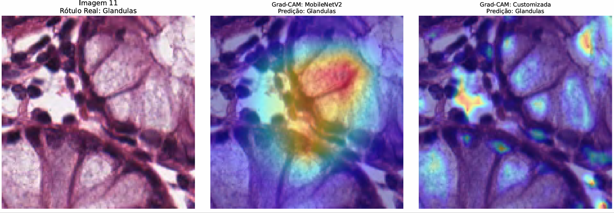

# Classificação de Imagens Histológicas de Câncer Colorretal - Aplicação de Redes Neurais Convolucionais para classificação de imagens médicas

Este projeto aplica técnicas de Deep Learning e Visão Computacional para a classificação multiclasse de texturas em imagens histológicas de câncer colorretal. Foi desenvolvido como atividade prática da disciplina de Inteligência Artificial.

## Objetivo do Projeto
Comparar o desempenho, a estabilidade de aprendizado e a interpretabilidade (via Grad-CAM) entre uma arquitetura de Rede Neural Convolucional (CNN) construída do zero e um modelo já consolidado de mercado utilizando Transfer Learning (MobileNetV2).

## Base de Dados
O dataset utilizado foi o 'colorectal_histology' (Kather et al., 2016), disponibilizado via TensorFlow Datasets. 
- **Tamanho:** 5.000 imagens RGB (150x150 pixels).
- **Divisão:** 70% para treinamento (3.500 imagens) e 30% para validação/teste (1.500 imagens).
- **Classes (8 categorias):** Tumor, Estroma Simples, Estroma Complexo, Células Imunológicas, Resíduos, Glândulas, Tecido Adiposo e Fundo.

## Arquiteturas Utilizadas

### 1. Modelo Base (Transfer Learning): MobileNetV2
- Pesos pré-treinados na base ImageNet (congelados na base convolucional).
- **Classificador Customizado:** 'GlobalAveragePooling2D' -> 'Dense (8 neurônios com ativação Softmax).

### 2. CNN personalizada
Rede sequencial de 9 camadas otimizada para extração de características de texturas celulares:
1. 'Conv2D' (32 filtros, 3x3, ReLU) + 'MaxPooling2D' (2x2)
2. 'Conv2D' (64 filtros, 3x3, ReLU) + 'MaxPooling2D' (2x2)
3. 'Conv2D' (128 filtros, 3x3, ReLU, name='ultima_conv') + 'MaxPooling2D' (2x2)
4. 'Flatten' -> 'Dense' (512 neurônios, ReLU)
5. 'Dropout' (0.5) para regularização e prevenção de overfitting.
6. 'Dense' (8 neurônios, Softmax)

## Resultados e Interpretabilidade
Os modelos foram treinados por 10 épocas usando o otimizador Adam. 
- O **MobileNetV2** apresentou convergência rápida e estável, atingindo ~88% de acurácia na validação por volta da 7ª época.
- A **CNN personalizada** apresentou maior variância (oscilando entre 65% e 80%), evidenciando a necessidade de técnicas adicionais para estabilizar o aprendizado em datasets menores.
- **Grad-CAM:** Mapas de calor foram gerados para ambos os modelos, confirmando que as redes utilizam estruturas coerentes (como o formato circular das glândulas e os núcleos densos do tumor) para a tomada de decisão, em vez de focar em ruídos do fundo da lâmina.
  
### Exemplo de Interpretabilidade (Grad-CAM)

  

  <em>Comparação do mapa de ativação entre o modelo Transfer Learning (centro) e a CNN Customizada (direita).</em>

## Como Executar
1. Clone o repositório.
2. Certifique-se de estar em um ambiente com suporte a GPU (recomenda-se o Google Colab).
3. Instale as dependências: 'pip install tensorflow tensorflow-datasets matplotlib seaborn opencv-python scikit-learn'
4. Execute o script principal
